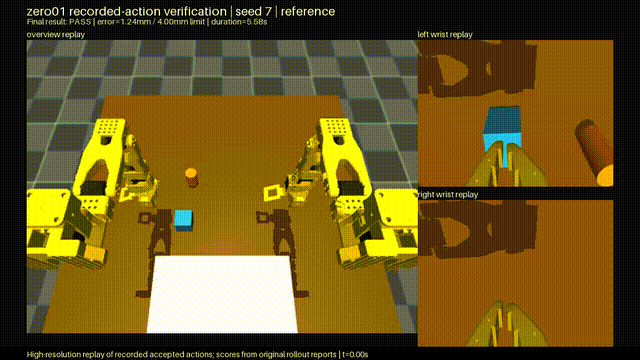

# zero01

**짧은 시연을 문맥으로 받아 양팔 로봇의 다음 행동을 예측하는 연구 프로토타입.**
SO-101 팔 2개, 손목 RGB 카메라 2개, 12축 관절 상태를 사용합니다.
GEN-1.5의 physical prompting, Zero-WAM의 미래 상태 예측, ACT/MACT의 action chunking을
작은 모델과 MuJoCo 실험으로 살펴봅니다.[^gen15][^wam][^act][^mact]

[정책 검증 영상](docs/assets/demo/zero01-demo.mp4) ·
[GIF](docs/assets/demo/zero01-demo.gif) ·
[작업별 검증](docs/TASK_VERIFICATION.md) ·
[구조](docs/ARCHITECTURE.md) · [설치와 실행](#설치와-실행)

[](docs/assets/demo/zero01-demo.mp4)

> 영상은 **MuJoCo에서 기준 동작·정지 대조군·학습 정책을 비교한 진단**입니다.
> 실제 로봇이나 아래 7개 작업의 성공 시연이 아닙니다.
> 이 저장소는 독립 연구 구현이며 공식 Zero-WAM 코드·체크포인트가 아닙니다.[^wam]

## 작업별 검증 현황

확장 검증 대상인 **물 따르기, 상의 접기, 바지 접기, 물건 정리, 책상 정리, 악수,
색상 컵 3개 쌓기는 모두 미실행**입니다. 현재 장면에는 블록과 원기둥만 있고
해당 작업의 시연 데이터와 성공 판정기가 없습니다.
[환경·체크포인트 조사](docs/verification/task-readiness.json)와
[작업별 성공 기준](docs/TASK_VERIFICATION.md)에 필요한 조건을 기록했습니다.
미실행을 모델의 실패나 성공률 0%로 계산하지 않습니다.

현재 진단은 학습에 사용한 **기본 블록 이동의 재현 여부**입니다.
두 초기 상태에서 기준 동작은 **2/2**, 정지 대조군은 **0/2**, 학습 정책은
**1/2** 성공했습니다. 목표 위치 오차 4mm 이내를 통과 기준으로 사용했습니다.
새 작업 일반화와 구분하며 입력 체크포인트·시연·실행 결과를 함께 제공합니다.
[측정 결과와 재현 방법](docs/DEMO.md), [실행 기록](docs/assets/demo/zero01-demo.json).

## 왜 필요한가

목표는 **작업이 바뀔 때마다 로봇 프로그램과 학습 과정을 다시 만드는 부담을 줄이는 것**입니다.
예를 들어 같은 물체도 밀기, 옮기기, 양손으로 잡기는 다른 동작입니다.
시연으로 작업을 지정하고 현재 관측에 맞춰 행동을 갱신할 수 있는지 연구합니다.
아래 각주는 연구 근거와 이 저장소의 설계 근거를 구분합니다.

### 1. 새로운 작업을 데이터 재수집만으로 해결하기 어렵습니다

Zero-WAM은 학습 때 보지 못한 작업을 배포 시점의 인간 영상·언어 문맥으로 지정하는
문제를 다룹니다. 작업마다 로봇 데이터를 새로 모으고 정책을 조정하는 부담이 연구의
출발점입니다.[^wam] 이 프로젝트에서는 같은 질문을 작은 SO-101 실험으로 옮겨,
시연 입력·학습·평가를 따로 재현할 수 있게 했습니다.[^local-training]

### 2. 말만으로 전달하기 어려운 동작 정보가 있습니다

물체의 배치, 접촉 순서, 중간 상태는 짧은 문장만으로 모호할 수 있습니다.
Zero-WAM은 인간 시연 영상을 시각적인 작업 명세로 사용합니다.[^wam]
이 저장소의 기본 physical prompt는 양쪽 손목 영상에 관절 상태와 행동 기록까지
포함합니다. 사람 영상만 쓰는 경로는 별도 인터페이스로 분리했습니다.[^local-input]

### 3. 현장에서 시연을 바꾸는 것과 모델을 다시 학습하는 것은 다릅니다

Generalist는 GEN-1.5에서 짧은 센서·행동 시연을 문맥에 넣고 가중치 갱신 없이
적응하는 physical prompting을 소개했습니다. 회사가 보고한 결과입니다.[^gen15]
여기서는 시연을 고정된 문맥으로 보존하고 실시간 관측을 갱신하는 구조를 구현했습니다.
**추론 중 재학습하지 않는다는 뜻이며 사전 학습이 필요 없다는 뜻은 아닙니다.**[^local-context]

### 4. 원하는 미래 상태와 실행할 관절 동작을 나눠 살펴봅니다

Zero-WAM은 미래 로봇 영상을 예측한 뒤 inverse dynamics로 행동을 복원합니다.[^wam]
이 구조를 따르면 작업의 시각적 목표와 로봇의 행동 변환을 각각 검사할 수 있습니다.
로컬 모델은 큰 영상 생성 모델 대신 **손목 영상의 압축 특징(latent)**을 예측합니다.
원본과 같은 영상 품질이나 행동 성능을 전제하지 않습니다.[^local-model]

### 5. 한 순간의 행동보다 짧은 행동 묶음과 관측 이력이 필요합니다

ACT는 여러 미래 행동을 한 묶음으로 예측하는 방식을 제안하고 MACT는 과거 영상 이력을
활용한 행동 묶음을 연구합니다. 두 연구의 장치와 과제는 이 프로젝트와 다릅니다.[^act][^mact]
이 구현은 짧은 관절 목표 묶음을 실행하면서 새 관측으로 다시 계획합니다.
미래 특징의 시간 순서를 보존할 때의 차이는 별도 decoder 실험으로 비교합니다.[^local-model]

### 6. 모델이 시연을 실제로 쓰는지 확인해야 합니다

Zero-WAM은 최근 로봇 이력만으로 다음 장면을 맞히고 시연을 무시하는 shortcut 문제를
지적하며 학습 전용 IFP 보조 목표를 제안합니다.[^wam]
그래서 이 프로젝트는 맞는 시연·다른 작업 시연·빈 시연을 비교하고
훈련과 검증 작업의 분리 및 입력 누출을 검사합니다.
출력이 달라졌다는 사실만으로 작업 이해나 인과적 시연 사용이 증명되지는 않습니다.[^local-controls]

### 7. 작은 양팔 실험계에서 가정을 검증합니다

SO-101과 LeRobot은 조립·캘리브레이션·양팔 제어의 공개 문서와 구현을 제공합니다.[^lerobot]
이 저장소는 이를 바탕으로 좌우 팔을 같은 12축 인터페이스로 다룹니다.
손목 카메라 2개만 필수 입력으로 삼은 것은 장치 구성을 제한한 **설계 가설**입니다.
두 시점만으로 모든 작업에 충분하다는 연구 결과가 아니며 헤드 카메라는 진단용입니다.[^local-input]

### 8. 영상이 그럴듯한 것과 로봇이 과제를 마친 것은 다릅니다

MuJoCo Menagerie의 공개 SO-101 모델은 반복 가능한 물리 실험의 출발점입니다.
모델의 물성과 실제 조립체가 같다고 보장하지는 않습니다.[^menagerie]
이 구현은 예측 오차, 명령 범위, 충돌, 물체 목표 도달을 따로 기록하고
체크포인트·설정·결과 파일을 해시로 연결합니다.
시뮬레이션 통과와 실물 검증을 구분하기 위한 설계입니다.[^local-validation]

## 동작 구조

```text
시연: 손목 영상 L/R + 관절 상태 + 행동 기록
                     │
              고정 시연 문맥
                     │
실시간 관측 ──→ 30초 인과적 문맥
                     │
              미래 손목 특징 예측
                     │
              역동역학 행동 복원
                     │
                짧은 행동 묶음
                     │
       관측 신선도 · 관절 범위 · 변화량 검사
                     │
          MuJoCo 또는 LeRobot 어댑터
                     │
                 다음 관측
```

기본 설정은 3–12초 시연, 최대 30초 문맥, 10Hz 정책 갱신,
50Hz 서보, 10개 관절 목표입니다. 10개 목표는 200ms 구간이며 새 정책 출력으로
갱신됩니다. 이는 [기본 설정](configs/mujoco.toml)의 값으로,
실물에서 측정한 속도·지연 보장은 아닙니다.[^local-context]

## 구현 범위와 현재 한계

| 기능 | 현재 범위 |
| --- | --- |
| 양팔·손목 카메라 | SO-101 2개, RGB 2개, 12축 입출력 계약과 MuJoCo 장면 |
| 문맥 기반 정책 | 고정 시연과 실시간 관측, 미래 latent → 행동 묶음 |
| 오프라인 학습 | 역동역학 사전 단계, 결합 학습, IFP, 작업 분리 검증 |
| 비교 실험 | 시연 대조군, decoder 순서 비교, 같은 과제 시뮬레이션 재구성 |
| 결과 검사 | 물체 위치, 명령·접촉 이력, 파일 무결성, 정적 결과 검증기 |
| 실제 하드웨어 | 연결 전 점검·시연 기록·출력 승인 조건 구현; 실물 성공 미검증 |

테스트 통과는 소프트웨어 계약에 대한 결과입니다. **새 작업 제로샷 성공,
사람 영상만으로 SO-101 제어, 실물 작업 성공은 아직 검증하지 않았습니다.**
기록된 같은 과제 학습 실험에서도 재구성 오차 감소와 폐루프 성공은 일치하지 않았습니다.
상세 결과와 한계는 [시뮬레이션 학습 기록](docs/SIM_REFERENCE_LEARNING.md),
[구현 차이 분석](docs/ZERO_WAM_GAP_ANALYSIS.md)에 있습니다.
과거 실험의 원시 `runs/` 자료는 로컬 보관 대상이며 저장소에는 포함하지 않습니다.

## 설치와 실행

Python 3.12 이상이 필요합니다. 아래 headless 예시는 Linux/WSL과 EGL을 기준으로 합니다.

```bash
git clone https://github.com/sel00000/zero01.git
cd zero01
python3 -m venv .venv
source .venv/bin/activate
python -m pip install -e '.[sim]'
export MUJOCO_GL=egl

# 가짜 장치의 정책 경로를 확인합니다.
python -m so101_wam.cli --steps 2

# 양팔·카메라·충돌 검사를 시뮬레이션에서 확인합니다.
python -m so101_wam.mujoco_cli --steps 2
```

EGL 라이브러리가 없는 Ubuntu 환경에서는 다음 패키지를 설치합니다.

```bash
sudo apt-get install libegl1 libgl1 libgl1-mesa-dri libglfw3
```

합성 데이터 생성 → 작은 모델 학습 → MuJoCo 실행 → 실제 출력 거부 확인:

```bash
python -m so101_wam.robot_free_cli --output-dir runs/robot_free_001
python -m so101_wam.robot_free_verifier \
  --result runs/robot_free_001/robot_free_result.json
```

매번 새 출력 디렉터리를 사용합니다. 이 경로는 학습·실행 연결을 검사하는
작은 합성 데이터 실험입니다. 실제 조작 능력의 벤치마크는 아닙니다.
하드웨어 준비는 [BRINGUP.md](docs/BRINGUP.md)를 따릅니다.
리더 팔로 조작하며 실제 전송 명령을 모으는 방법은 [시연 기록](docs/TELEOP_RECORDING.md)에 있습니다.

## 영상과 GIF 재생성

```bash
python -m pip install Pillow
MUJOCO_GL=egl OMP_NUM_THREADS=1 MKL_NUM_THREADS=1 \
  python scripts/verify_demo_policy.py --run-dir runs/zero01_verification_001
```

FFmpeg가 PATH에 있어야 합니다. 새 정책 실행은 빈 `--run-dir`을 지정하고
기존 실행 기록은 `--replay-from`으로 영상만 다시 만듭니다.
영상은 `docs/assets/demo/`에, 원시 실행 기록은 지정한 디렉터리에 저장합니다.
작은 진단용 체크포인트와 시뮬레이션 시연 입력도 포함합니다.
영상 구성, 재현 조건, 파일 해시는 [DEMO.md](docs/DEMO.md)에 설명합니다.

## 검증

```bash
python -m pip install pytest ruff mypy
python -m ruff check src tests scripts/verify_demo_policy.py
python -m mypy src
python -m compileall -q src tests scripts/verify_demo_policy.py
python -m pytest -q
bash scripts/validate_mujoco.sh
```

[GitHub Actions](.github/workflows/ci.yml)는 패키지 설치, 의존성, 린트,
타입 검사, 전체 테스트와 MuJoCo 검증을 실행합니다.

## 문서

| 목적 | 문서 |
| --- | --- |
| 모델과 데이터 흐름 | [구조](docs/ARCHITECTURE.md), [학습](docs/TRAINING.md) |
| 장치 구성과 준비 | [하드웨어](docs/HARDWARE.md), [실물 준비](docs/BRINGUP.md) |
| 시뮬레이션과 데모 | [MuJoCo](docs/MUJOCO.md), [영상 재현](docs/DEMO.md) |
| 확장 검증 대상 7개 작업 | [검증 조건과 현재 상태](docs/TASK_VERIFICATION.md), [환경 조사](docs/verification/task-readiness.json) |
| 시연이 행동에 미치는 영향 | [시연 대조군](docs/PROMPT_CONTROLS.md), [IFP](docs/IFP_ABLATION.md) |
| 사람 영상·언어 입력 | [입력 계약](docs/TASK_SPECS.md), [영상·로봇 쌍](docs/PAIRED_DATA.md) |
| 비교·후속 실험 | [Decoder](docs/DECODER_ABLATION.md), [추가 검증](docs/ROBOT_FREE_EXTENSIONS.md), [시뮬레이션 학습](docs/SIM_REFERENCE_LEARNING.md) |
| 검증 범위 | [검증 단계](docs/VALIDATION.md), [출력 조건](docs/CERTIFICATION.md), [그리퍼 수정](docs/GRIPPER_BOUNDARY_FIXES.md) |
| 원 연구와의 관계 | [영상 근거](docs/VIDEO_REFERENCE.md), [구현 차이](docs/ZERO_WAM_GAP_ANALYSIS.md) |

## 출처와 구성요소

연구 아이디어의 출처는 아래 각주에 표기했습니다. 원 논문의 성능 수치를
이 구현의 결과로 사용하지 않습니다. SO-101 MJCF와 mesh의 원 출처·커밋은
[모델 출처](src/so101_wam/assets/MENAGERIE_PROVENANCE.md)에,
해당 구성요소의 Apache-2.0 라이선스는
[모델 LICENSE](src/so101_wam/assets/mujoco_menagerie/robotstudio_so101/LICENSE)에 있습니다.
프로젝트 코드의 별도 라이선스는 지정하지 않았습니다.

[^wam]: Zhou et al., [Zero-WAM: In-Context World-Action Modeling from Human Videos for Open-Ended Task Generalization](https://arxiv.org/html/2608.26103), §1, §3.1–3.3. 새 작업 일반화, 영상 작업 명세, 미래 영상·역동역학 분해, 시연 무시 문제와 IFP의 연구 근거입니다. [공식 프로젝트](https://robbyant-research.github.io/Zero-WAM/). 여기서 보고된 성능은 이 저장소의 성능이 아닙니다.

[^gen15]: Generalist, [GEN-1.5: Embodied Foundation Models are One-Shot Learners](https://generalistai.com/blog/gen-1.5), 2026-08-19. Physical prompting과 in-context adaptation의 공식 소개입니다. 회사의 시연·보고이며 SO-101에서의 독립 검증은 아닙니다.

[^act]: Zhao et al., [Learning Fine-Grained Bimanual Manipulation with Low-Cost Hardware](https://arxiv.org/abs/2304.13705), 2023. ACT의 행동 묶음 예측에 대한 근거입니다. ALOHA의 결과를 SO-101에 그대로 적용하지 않습니다.

[^mact]: Yang et al., [Memorized action chunking with Transformers: Imitation learning for vision-based tissue surface scanning](https://arxiv.org/abs/2411.04050), 2024. 과거 영상 이력과 행동 묶음의 연구 사례입니다. 조직 표면 스캐닝이라는 다른 도메인의 연구입니다.

[^lerobot]: Hugging Face LeRobot v0.6.1, [SO-101 문서](https://github.com/huggingface/lerobot/blob/v0.6.1/docs/source/so101.mdx), [양팔 follower 구현](https://github.com/huggingface/lerobot/tree/v0.6.1/src/lerobot/robots/bi_so_follower). 공개 장치·제어 인터페이스의 근거이며 작업 성공의 근거는 아닙니다.

[^menagerie]: Google DeepMind, [MuJoCo Menagerie](https://github.com/google-deepmind/mujoco_menagerie), [사용한 SO-101 모델 커밋](https://github.com/google-deepmind/mujoco_menagerie/tree/da76818e269b82289eba39808e2fb91d679d6994/robotstudio_so101). 모델 출처와 품질 범위를 확인할 수 있습니다.

[^local-training]: 로컬 구현: [학습 계약](docs/TRAINING.md), [training_data.py](src/so101_wam/training_data.py), [학습 데이터 테스트](tests/test_training_data.py). 작업 분리·정규화·시연 중복 검사의 구현 근거입니다.

[^local-input]: 로컬 설계: [입력 계약](docs/TASK_SPECS.md), [하드웨어 관측](docs/HARDWARE.md), [contracts.py](src/so101_wam/contracts.py). 센서모터 시연과 사람 영상 전용 입력은 서로 다른 정보 조건입니다.

[^local-context]: 로컬 구현: [기본 설정](configs/mujoco.toml), [문맥 관리](src/so101_wam/context.py), [문맥 테스트](tests/test_context.py), [정책 테스트](tests/test_policy.py). 문맥 길이·갱신 주기는 설정값이며 처리 속도 벤치마크가 아닙니다.

[^local-model]: 로컬 구현: [model.py](src/so101_wam/model.py), [runtime.py](src/so101_wam/runtime.py), [Decoder 비교](docs/DECODER_ABLATION.md). 미래 latent와 행동 묶음, 시간 순서 비교의 구현 근거입니다.

[^local-controls]: 로컬 검증: [시연 대조군](docs/PROMPT_CONTROLS.md), [IFP 비교](docs/IFP_ABLATION.md), [입력 격리 테스트](tests/test_task_specs.py). 입력 누출·시연 무시를 검사하는 방법이며 인과성이나 일반화 성공의 증명은 아닙니다.

[^local-validation]: 로컬 구현: [safety.py](src/so101_wam/safety.py), [물체 상태 평가](src/so101_wam/mujoco_semantic_benchmark.py), [결과 검증기](src/so101_wam/robot_free_verifier.py), [검증 단계](docs/VALIDATION.md). 파일 해시는 무결성 검사이며 물리 실험의 독립 인증이 아닙니다.
